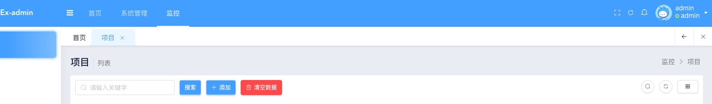
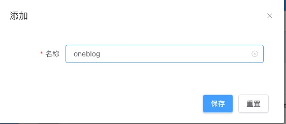
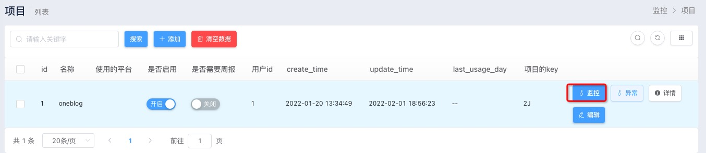
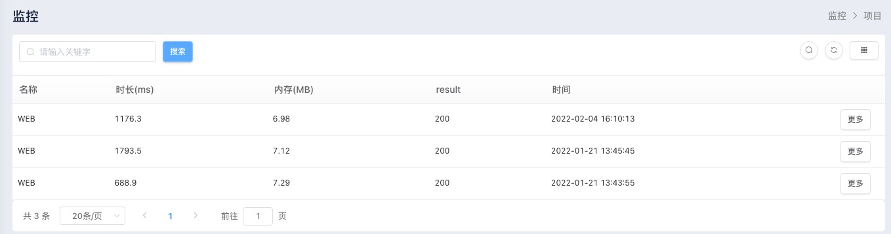
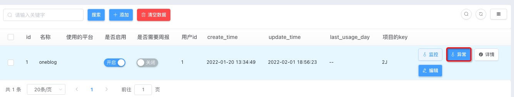
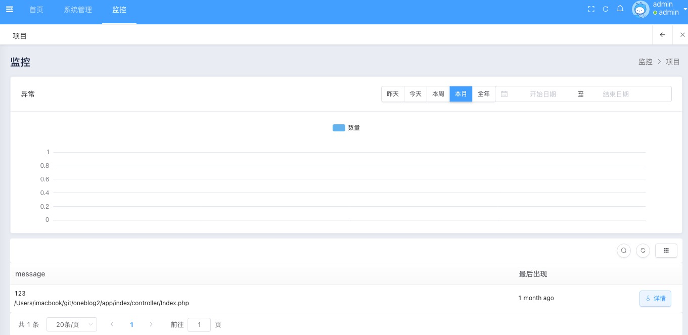

# 监控面版

## 安装

在 linux or win 服务器 里 clone 项目 

~~~ shell
git clone https://github.com/yangweijie/open-monitor-backend.git <dir>

cd <dir>

composer install

cp .example.env  .env # 并配置

php think migrate:run 

php think seed:eadmin

php think seed:run

~~~

执行后 默认会得到一个管理员账号 

通过 `/admin` 访问后 admin admin 登录

## 步骤

### 创建项目

点击监控模块-> 点击添加

输入项目名

拿到项目的key

### 配置好采集器

设置url 为 http://<域名>/handle

### 访问产生会话或异常

### 查看监控信息

会话

片段

### 查看异常

