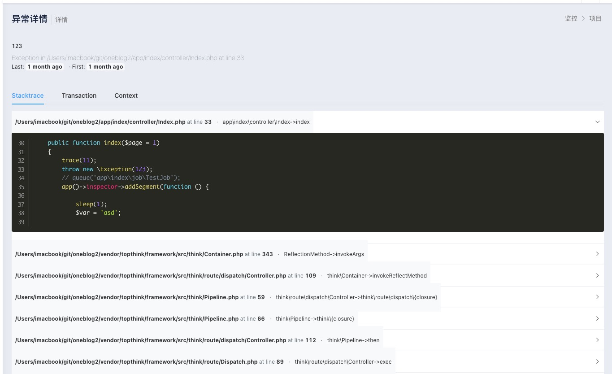
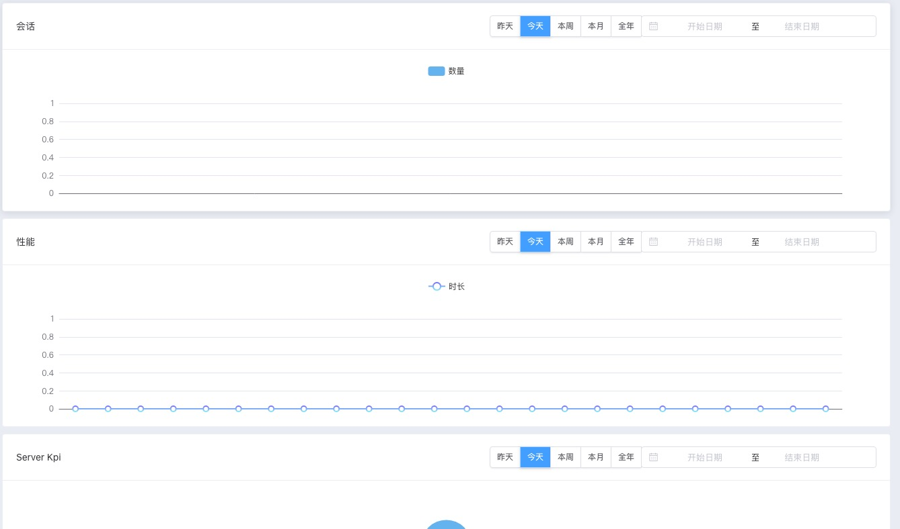

# 监控面版

## 安装

在 linux or win 服务器 里 clone 项目 

~~~ shell
git clone https://github.com/yangweijie/open-monitor-backend.git <dir>

cd <dir>

composer install

cp .example.env  .env # 并配置

source ./data/monitor.sql # 手动通过工具导入也可以
~~~

执行后 默认会得到一个管理员账号 

通过 `/admin` 访问后 admin admin 登录

### 省略入口

~~~ apache
SetEnvIf Authorization "(.*)" HTTP_AUTHORIZATION=$1
<IfModule mod_rewrite.c>
  Options +FollowSymlinks -Multiviews
  RewriteEngine On

  RewriteCond %{REQUEST_FILENAME} !-d
  RewriteCond %{REQUEST_FILENAME} !-f
  RewriteRule ^(.*)$ index.php?s=/$1 [QSA,PT,L]
</IfModule>
~~~

~~~ nginx
location / {
    if (!-e $request_filename) {
        rewrite  ^(.*)$  /index.php?s=/$1  last;
        break;
    }
}
~~~

## 步骤

### 创建项目

点击监控模块-> 点击添加

输入项目名

拿到项目的key

### 配置好采集器

设置url 为 http://<域名>/handle

### 访问产生会话或异常

### 查看监控信息

会话

片段

### 查看异常

## 已知问题

[]生成迁移脚本里 不包括 eadmin之外的表

[]监控页面的统计报表 组件是3个独立的日期筛选（取消注释可见）应该是一个统计组件 e-admin 的chart组件 不支持
